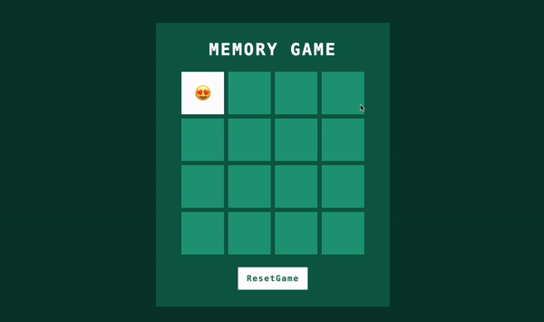

# Memory Game

Bienvenue dans le dépôt du **Memory Game**. Ce projet est un jeu de mémoire classique développé en JavaScript, HTML et CSS. Le but du jeu est de trouver toutes les paires de cartes correspondantes avec le moins de coups possible.

## Démo

## Fonctionnalités

- Interface utilisateur simple et intuitive
- Détection des paires de cartes
- Compteur de coups
- Redémarrage du jeu

## Technologies Utilisées

- **JavaScript** : pour la logique du jeu
- **HTML** : pour la structure de la page
- **CSS** : pour le style et la mise en page
